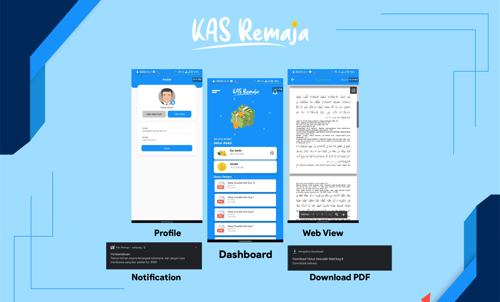

  <a href="#">
		

  </a>

  KAS REMAJA merupakan project OpenSource yang di kembangkan oleh Zero Dev, yang bertujuan untuk mempermudah pengelolaan administrasi dalam sebuah organisasi atau kelompok, Project ini free dan open source (Boleh di kembangkan lagi)

 

 

 
Screenshot

 

  
 <h1>Rest API (Codeigniter)</h1>
 
KAS REMAJA API [Zero](http://github.com/akbarabdul80/Kas-Remaja-API)

	
 <h1>Creator</h1>
 
KAS REMAJA App is created by [Zero](http://github.com/akbarabdul80)

 
You can contact me at : akbarabdul80@gmail.com

 <h1>License</h1>
 
KAS REMAJA App is under the [Apache License](LICENSE)

